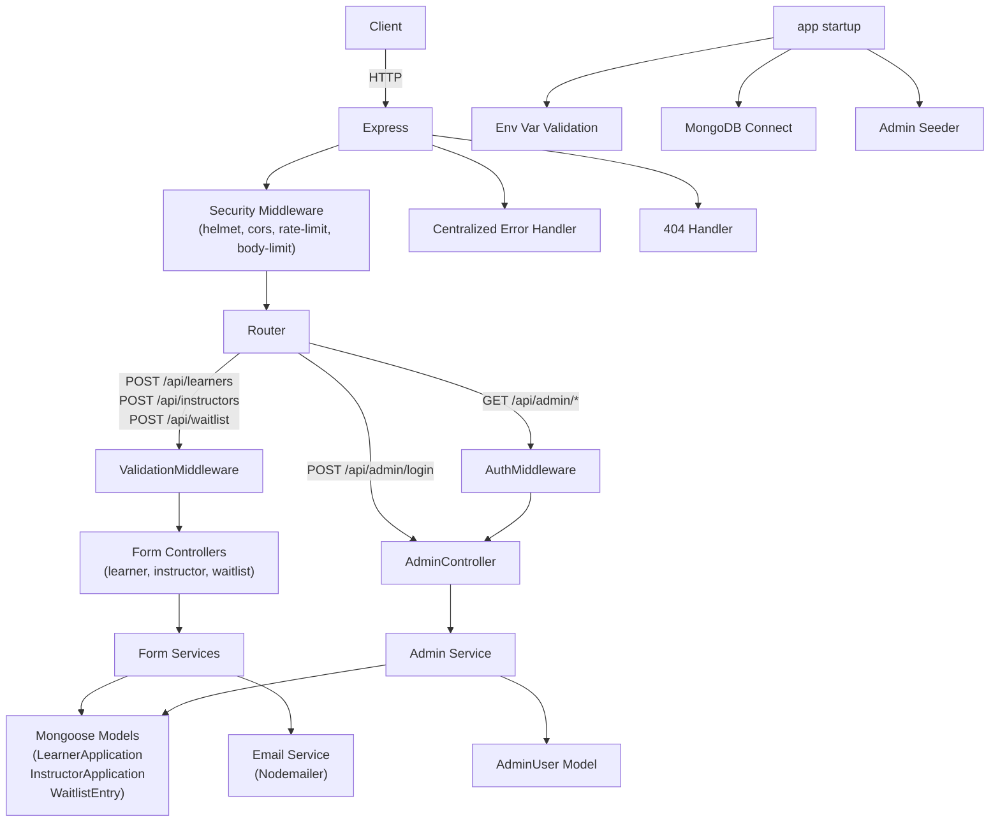

# Design Document: form-submission-backend

## Overview

The form-submission-backend is a production-ready REST API built with Node.js, TypeScript, Express.js, MongoDB/Mongoose, and Nodemailer. It handles three form types (Learner Applications, Instructor Applications, Waitlist Signups), persists records to MongoDB, sends confirmation emails via SMTP, and exposes a JWT-protected admin interface for reviewing submissions.

The system is designed around a layered architecture: routes → validation middleware → controllers → services → models. Cross-cutting concerns (auth, error handling, rate limiting, security headers) are handled by middleware. All configuration is loaded from environment variables at startup with strict validation.

### Key Design Goals

- Clean separation of concerns via layered architecture
- Strict input validation with Zod before any data reaches the database
- Consistent API response shape across all endpoints
- Fail-safe email delivery (email errors never block successful form saves)
- Secure admin access via bcrypt + JWT
- Startup-time validation of all required environment variables

---

## Architecture



### Request Lifecycle

1. Request arrives at Express
2. Global middleware runs: morgan (dev), helmet, cors, body-limit
3. Route-specific rate limiter runs on POST routes
4. For public POST routes: Zod validation middleware runs, then controller
5. For admin routes (except login): AuthMiddleware validates JWT, then controller
6. Controller calls service layer
7. Service interacts with Mongoose models and (for form submissions) email service
8. Response returned in `{ success, message, data }` shape
9. Any error passed to `next(err)` is caught by centralized ErrorHandler

---

## Components and Interfaces

### Project Folder Structure

```
src/
  config/
    env.ts          # env var validation and export
    db.ts           # MongoDB connection
  controllers/
    learner.controller.ts
    instructor.controller.ts
    waitlist.controller.ts
    admin.controller.ts
  routes/
    learner.routes.ts
    instructor.routes.ts
    waitlist.routes.ts
    admin.routes.ts
    index.ts        # mounts all routers
  models/
    LearnerApplication.model.ts
    InstructorApplication.model.ts
    WaitlistEntry.model.ts
    AdminUser.model.ts
  services/
    learner.service.ts
    instructor.service.ts
    waitlist.service.ts
    admin.service.ts
    email.service.ts
  validations/
    learner.schema.ts
    instructor.schema.ts
    waitlist.schema.ts
    admin.schema.ts
    validate.middleware.ts  # generic Zod validation middleware factory
  middleware/
    auth.middleware.ts      # JWT Bearer verification
    errorHandler.ts         # centralized error handler
    notFound.ts             # 404 handler
  templates/
    confirmation.html.ts    # HTML email template function
  utils/
    asyncHandler.ts         # wraps async route handlers
    AppError.ts             # typed operational error class
    seeder.ts               # admin user seeder
  app.ts                    # Express app setup (no listen)
  server.ts                 # entry point: env validate, db connect, seed, listen
```

### Key Component Interfaces

#### AppError

```typescript
class AppError extends Error {
  statusCode: number;
  isOperational: boolean;
  constructor(message: string, statusCode: number);
}
```

#### asyncHandler

```typescript
function asyncHandler(
  fn: (req: Request, res: Response, next: NextFunction) => Promise<any>
): RequestHandler
```

#### validate middleware factory

```typescript
function validate(schema: ZodSchema): RequestHandler
// Returns middleware that parses req.body against schema.
// On failure: next(new AppError(..., 400)) with errors array attached
```

#### AuthMiddleware

```typescript
// Extracts Bearer token from Authorization header
// Verifies with JWT_SECRET
// Attaches decoded payload to req.admin
// On failure: next(new AppError("Unauthorized", 401))
```

#### EmailService

```typescript
interface SendConfirmationOptions {
  to: string;
  subject: string;
  firstName?: string;
  formType: "learner" | "instructor" | "waitlist";
}

async function sendConfirmation(options: SendConfirmationOptions): Promise<void>
```

#### AdminService

```typescript
async function login(email: string, password: string): Promise<{ token: string; admin: AdminPayload }>
async function getDashboard(): Promise<DashboardData>
async function getRecords(model: Model, query: PaginatedQuery): Promise<PaginatedResult>
```

#### PaginatedQuery / PaginatedResult

```typescript
interface PaginatedQuery {
  page?: number;
  limit?: number;
  email?: string;
  name?: string;
}

interface PaginatedResult<T> {
  records: T[];
  total: number;
  page: number;
  limit: number;
}
```

### API Endpoints

| Method | Path | Auth | Description |
|--------|------|------|-------------|
| POST | /api/learners | None | Submit learner application |
| POST | /api/instructors | None | Submit instructor application |
| POST | /api/waitlist | None | Submit waitlist signup |
| POST | /api/admin/login | None | Admin login, returns JWT |
| GET | /api/admin/dashboard | JWT | Summary stats + recent records |
| GET | /api/admin/learners | JWT | Paginated + searchable learner records |
| GET | /api/admin/instructors | JWT | Paginated + searchable instructor records |
| GET | /api/admin/waitlist | JWT | Paginated + searchable waitlist records |

### Response Shape

Success:
```json
{ "success": true, "message": "...", "data": { ... } }
```

Error:
```json
{ "success": false, "message": "...", "errors": [ ... ] }
```

Admin login success:
```json
{ "success": true, "token": "<JWT>", "admin": { "name": "...", "email": "...", "role": "..." } }
```

---

## Data Models

### LearnerApplication

```typescript
{
  firstName:    string;   // required
  lastName:     string;   // required
  email:        string;   // required, unique index
  phone?:       string;
  country?:     string;
  modules?:     string[]; // array of module names
  certs?:       string[]; // array of certification names
  message?:     string;
  createdAt:    Date;     // auto (timestamps: true)
  updatedAt:    Date;     // auto (timestamps: true)
}
```

### InstructorApplication

```typescript
{
  firstName:    string;   // required
  lastName:     string;   // required
  email:        string;   // required, unique index
  phone?:       string;
  country?:     string;
  teachModules?: string[]; // modules they can teach
  timeSlots?:   string[]; // availability time slots
  experience?:  string;
  message?:     string;
  createdAt:    Date;
  updatedAt:    Date;
}
```

### WaitlistEntry

```typescript
{
  email:     string;  // required, unique index
  source?:   string;  // optional referral source
  createdAt: Date;
  updatedAt: Date;
}
```

### AdminUser

```typescript
{
  email:    string;  // required, unique index
  password: string;  // required, bcrypt hash (never returned in responses)
  name:     string;  // required
  role:     string;  // required, default "admin"
  createdAt: Date;
  updatedAt: Date;
}
```

All models have `timestamps: true` and an index on `email`.

### Zod Validation Schemas

**Learner schema** — required: `firstName`, `lastName`, `email` (valid email format); optional: `phone`, `country`, `modules` (string[]), `certs` (string[]), `message`.

**Instructor schema** — required: `firstName`, `lastName`, `email` (valid email format); optional: `phone`, `country`, `teachModules` (string[]), `timeSlots` (string[]), `experience`, `message`.

**Waitlist schema** — required: `email` (valid email format); optional: `source`.

**Admin login schema** — required: `email` (valid email format), `password` (non-empty string).

### Environment Variables

| Variable | Required | Description |
|----------|----------|-------------|
| PORT | yes | HTTP server port |
| MONGODB_URI | yes | MongoDB connection string |
| SMTP_HOST | yes | SMTP server hostname |
| SMTP_PORT | yes | SMTP server port |
| SMTP_USER | yes | SMTP username |
| SMTP_PASS | yes | SMTP password |
| SMTP_FROM_EMAIL | yes | Sender email address |
| SMTP_FROM_NAME | yes | Sender display name |
| JWT_SECRET | yes | Secret for signing JWTs |
| JWT_EXPIRES_IN | yes | JWT expiry (e.g. "7d") |
| ADMIN_EMAIL | yes | Default admin email for seeder |
| ADMIN_NAME | yes | Default admin name for seeder |
| ADMIN_PASSWORD | yes | Default admin password for seeder |
| CORS_ORIGIN | no | Allowed CORS origin(s) |
| RATE_LIMIT_MAX | no | Max POST requests per window (default 100) |
| RATE_LIMIT_WINDOW_MS | no | Rate limit window in ms (default 900000) |
| NODE_ENV | no | "development" or "production" |

---

## Correctness Properties

*A property is a characteristic or behavior that should hold true across all valid executions of a system — essentially, a formal statement about what the system should do. Properties serve as the bridge between human-readable specifications and machine-verifiable correctness guarantees.*

### Property 1: Valid form submission saves a document (round-trip)

*For any* valid form payload of any type (learner, instructor, or waitlist), submitting it via the corresponding POST endpoint should result in a new document being persisted to MongoDB, and that document should be retrievable via the admin GET endpoint with the same field values.

**Validates: Requirements 1.1, 2.1, 3.1, 17.1, 17.2, 17.3**

### Property 2: Successful form submission returns 201 with correct response shape

*For any* valid form payload, a successful POST to the corresponding endpoint should return HTTP status 201 with a response body matching `{ success: true, message: string, data: <saved document> }`.

**Validates: Requirements 1.2, 2.2, 3.2**

### Property 3: Successful form submission triggers confirmation email

*For any* valid form payload, after a successful save, the email service should be called exactly once with the submitted email address and the correct subject for that form type.

**Validates: Requirements 1.3, 2.3, 3.3**

### Property 4: Mailer failure does not affect HTTP 201 response

*For any* valid form payload, if the email service throws an error, the HTTP response should still be 201 with the correct success shape — the mailer error must not propagate to the client.

**Validates: Requirements 1.4, 2.4, 3.4**

### Property 5: Invalid form payload returns 400 with structured errors

*For any* request body that fails Zod schema validation (missing required fields, invalid email format, wrong types), the response should be HTTP 400 with shape `{ success: false, message: "Validation error", errors: [...] }`, and the errors array should contain the name of each failing field.

**Validates: Requirements 1.5, 2.5, 3.5, 12.1, 12.2, 12.3, 12.4**

### Property 6: Database error returns 500 with error response shape

*For any* form submission where the database throws an error during save, the response should be HTTP 500 with shape `{ success: false, message: string }`.

**Validates: Requirements 1.6, 2.6, 3.6**

### Property 7: Protected routes reject absent or invalid JWT

*For any* request to a `/api/admin/*` route (except `/api/admin/login`) where the Authorization header is absent, malformed (not Bearer scheme), contains an invalid token, or contains an expired token, the response should be HTTP 401 with `{ success: false, message: "Unauthorized" }`.

**Validates: Requirements 6.1, 6.3, 6.4**

### Property 8: Valid JWT allows request to proceed

*For any* request to a protected admin route that includes a valid, non-expired Bearer JWT signed with JWT_SECRET, the request should proceed to the handler and the decoded admin identity should be available in the request context.

**Validates: Requirements 6.2**

### Property 9: Dashboard total counts match actual collection sizes

*For any* state of the database, the `totalLearners`, `totalInstructors`, and `totalWaitlist` values returned by `/api/admin/dashboard` should equal the actual document counts in their respective collections.

**Validates: Requirements 7.2**

### Property 10: Dashboard recent records are the 5 most recent, sorted descending

*For any* state of the database, the `recentLearners`, `recentInstructors`, and `recentWaitlist` arrays returned by `/api/admin/dashboard` should contain at most 5 documents each, and they should be the documents with the highest `createdAt` values, sorted descending.

**Validates: Requirements 7.3**

### Property 11: Admin list endpoints return paginated, sorted, searchable results

*For any* state of the database and any combination of `page`, `limit`, `email`, and `name` query parameters, the admin list endpoints (`/api/admin/learners`, `/api/admin/instructors`, `/api/admin/waitlist`) should:
- Return only documents matching the search term (case-insensitive) when a search parameter is provided
- Return the correct paginated slice based on `page` and `limit`
- Return documents sorted by `createdAt` descending
- Include the correct `total`, `page`, and `limit` values in the response

**Validates: Requirements 8.1, 8.2, 8.3, 9.1, 9.2, 9.3, 10.1, 10.2, 10.3**

### Property 12: Email template greeting uses firstName when present

*For any* call to the email template function, if a `firstName` is provided the rendered HTML should contain that name in the greeting; if no `firstName` is provided the rendered HTML should contain a generic greeting and must not contain "undefined" or empty name placeholders.

**Validates: Requirements 11.1**

### Property 13: Email template references the form type

*For any* call to the email template function with a given `formType`, the rendered HTML should contain a string referencing that form type (e.g., "learner application", "instructor application", "waitlist").

**Validates: Requirements 11.2**

### Property 14: Rate limiter returns 429 after limit is exceeded

*For any* IP address that sends more POST requests than the configured `RATE_LIMIT_MAX` within the `RATE_LIMIT_WINDOW_MS` window, the next request from that IP should receive HTTP 429.

**Validates: Requirements 13.3**

### Property 15: Request body over 1MB is rejected

*For any* request with a body exceeding 1MB, the system should reject it before it reaches the controller.

**Validates: Requirements 13.4**

### Property 16: Error handler returns consistent error shape

*For any* error passed to Express's `next(err)`, the centralized error handler should return a response with shape `{ success: false, message: string }` and the HTTP status code from the AppError (or 500 for unexpected errors). In production mode, the response must not include a stack trace.

**Validates: Requirements 16.1, 13.5**

---

## Error Handling

### AppError Class

All operational errors are represented as `AppError` instances with a `statusCode` and `isOperational` flag. This allows the centralized error handler to distinguish between expected errors (e.g., 401 Unauthorized, 400 Bad Request) and unexpected programming errors.

```typescript
class AppError extends Error {
  constructor(
    public message: string,
    public statusCode: number,
    public isOperational = true
  ) {
    super(message);
    Object.setPrototypeOf(this, AppError.prototype);
  }
}
```

### asyncHandler Wrapper

All async route handlers are wrapped with `asyncHandler` to avoid repetitive try/catch blocks:

```typescript
const asyncHandler = (fn: AsyncRequestHandler) =>
  (req: Request, res: Response, next: NextFunction) =>
    Promise.resolve(fn(req, res, next)).catch(next);
```

### Centralized Error Handler

The global error handler middleware (registered last in `app.ts`) handles all errors:

- `AppError` instances: use `err.statusCode` and `err.message`
- Mongoose `ValidationError`: map to 400 with field-level errors
- Mongoose `CastError` (invalid ObjectId): map to 400
- Mongoose duplicate key error (code 11000): map to 409 Conflict
- JWT `JsonWebTokenError` / `TokenExpiredError`: map to 401
- All other errors: 500, generic message in production (no stack trace)

In `NODE_ENV=production`, stack traces are omitted from all error responses.

### Validation Errors

The Zod validation middleware catches `ZodError` and formats it into the standard error shape:

```json
{
  "success": false,
  "message": "Validation error",
  "errors": [
    { "field": "email", "message": "Invalid email" },
    { "field": "firstName", "message": "Required" }
  ]
}
```

### Email Failure Handling

Email sending is wrapped in a try/catch inside the service layer. On failure, the error is logged (e.g., `console.error` or a logger) but is not re-thrown. The controller receives a resolved promise and returns 201 regardless.

### Startup Failures

The `server.ts` entry point validates env vars, connects to MongoDB, and runs the seeder before calling `app.listen`. Any failure in these steps logs a descriptive error and calls `process.exit(1)`.

### 404 Handler

A catch-all route registered after all other routes returns:

```json
{ "success": false, "message": "Route not found" }
```

with HTTP 404.

---

## Testing Strategy

### Dual Testing Approach

Both unit/integration tests and property-based tests are required. They are complementary:

- **Unit/integration tests**: verify specific examples, edge cases, error conditions, and integration between components
- **Property-based tests**: verify universal properties across many randomly generated inputs

### Property-Based Testing

**Library**: [fast-check](https://github.com/dubzzz/fast-check) (TypeScript-native PBT library)

Each property-based test must:
- Run a minimum of **100 iterations** (fast-check default; increase with `numRuns` for critical properties)
- Include a comment tag referencing the design property:
  `// Feature: form-submission-backend, Property N: <property_text>`
- Be implemented as a **single test per design property**

**Properties to implement as property-based tests:**

| Design Property | Test Description |
|----------------|-----------------|
| Property 1 | Generate random valid learner/instructor/waitlist payloads, POST, verify document saved and retrievable |
| Property 2 | Generate random valid payloads, verify 201 + response shape |
| Property 3 | Generate random valid payloads, mock mailer, verify called with correct email + subject |
| Property 4 | Generate random valid payloads, mock mailer to throw, verify 201 still returned |
| Property 5 | Generate invalid payloads (missing fields, bad emails), verify 400 + errors array contains field names |
| Property 6 | Mock DB to throw, verify 500 response shape |
| Property 7 | Generate random strings as tokens (invalid), verify 401 on protected routes |
| Property 8 | Generate valid JWT payloads, sign them, verify requests proceed |
| Property 9 | Generate random sets of documents, verify dashboard totals match counts |
| Property 10 | Generate random sets of documents with varying createdAt, verify recent arrays are top-5 desc |
| Property 11 | Generate random page/limit/search combinations, verify pagination and filtering correctness |
| Property 12 | Generate random firstName values (present/absent), verify greeting in rendered HTML |
| Property 13 | Generate random formType values, verify form type appears in rendered HTML |
| Property 14 | Simulate requests exceeding rate limit, verify 429 |
| Property 15 | Generate bodies over 1MB, verify rejection |
| Property 16 | Generate AppError instances with random status codes and messages, verify error handler response shape |

### Unit / Integration Tests

Unit tests should focus on:

- **Seeder**: empty DB → admin created with bcrypt hash; existing admin → no duplicate created
- **Admin login**: correct credentials → JWT returned; wrong password → 401; unknown email → 401; missing fields → 400
- **JWT content**: decoded token contains correct admin identity fields
- **Env validation**: missing each required env var → process exits with non-zero code
- **404 handler**: unknown route → 404 with correct shape
- **Security headers**: response includes helmet headers (e.g., `X-Content-Type-Options`)
- **CORS headers**: response includes correct CORS headers
- **Production error shape**: errors in production mode omit stack traces
- **Model structure**: LearnerApplication, InstructorApplication, WaitlistEntry, AdminUser documents have `createdAt`, `updatedAt`, and email index

### Test Configuration

```typescript
// fast-check property test example
import fc from "fast-check";

test("Property 5: invalid email rejected with 400", async () => {
  // Feature: form-submission-backend, Property 5: invalid form payload returns 400 with structured errors
  await fc.assert(
    fc.asyncProperty(fc.string(), async (invalidEmail) => {
      fc.pre(!invalidEmail.includes("@") || invalidEmail.length < 3);
      const res = await request(app)
        .post("/api/learners")
        .send({ firstName: "Test", lastName: "User", email: invalidEmail });
      expect(res.status).toBe(400);
      expect(res.body.success).toBe(false);
      expect(res.body.errors).toBeDefined();
    }),
    { numRuns: 100 }
  );
});
```

### Test Environment

- Use an in-memory MongoDB instance (e.g., `mongodb-memory-server`) for all tests
- Mock Nodemailer transport to avoid real SMTP calls
- Use `supertest` for HTTP-level integration tests
- Test runner: **Jest** or **Vitest**
